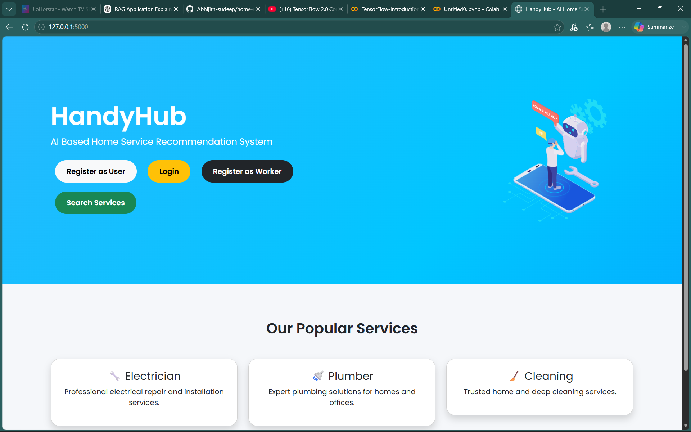
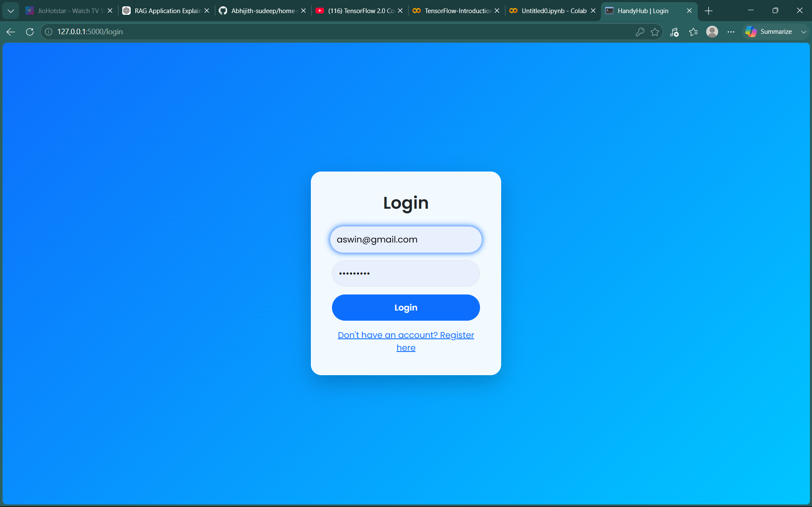
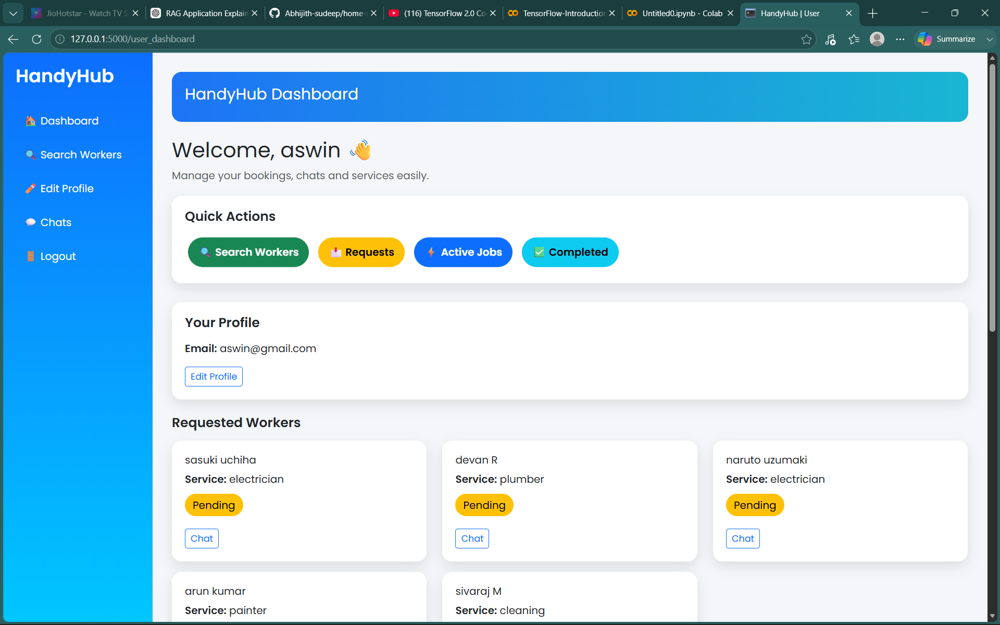
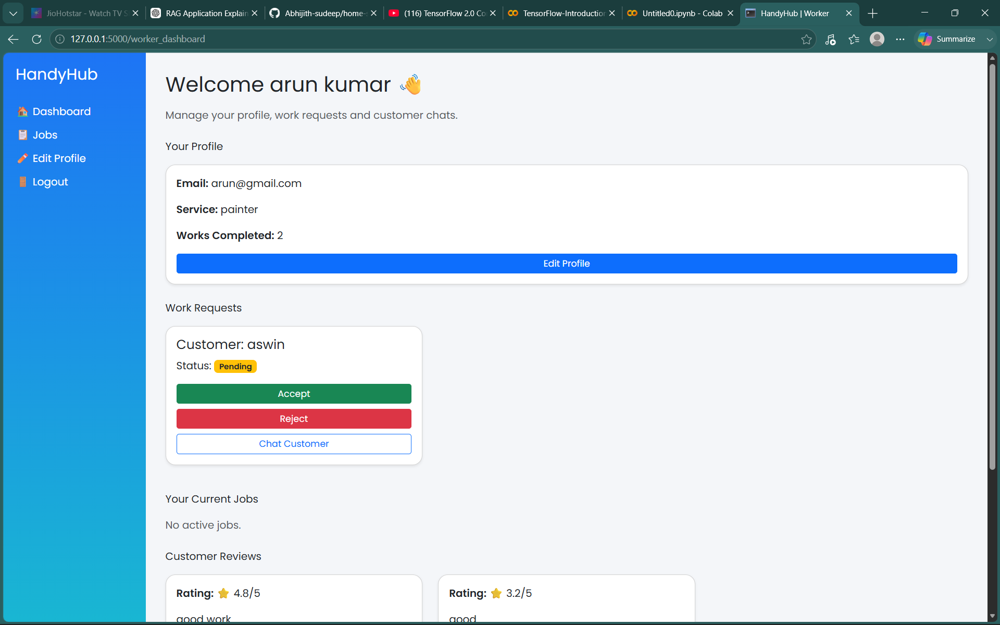
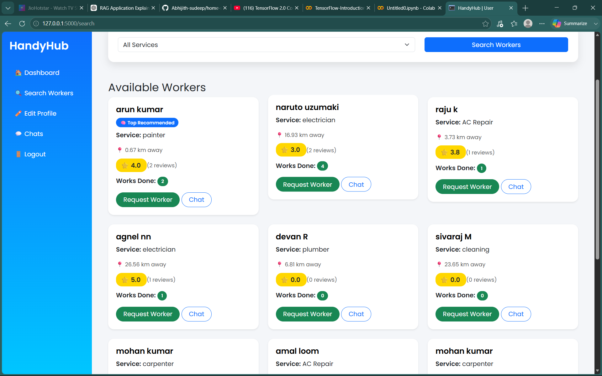
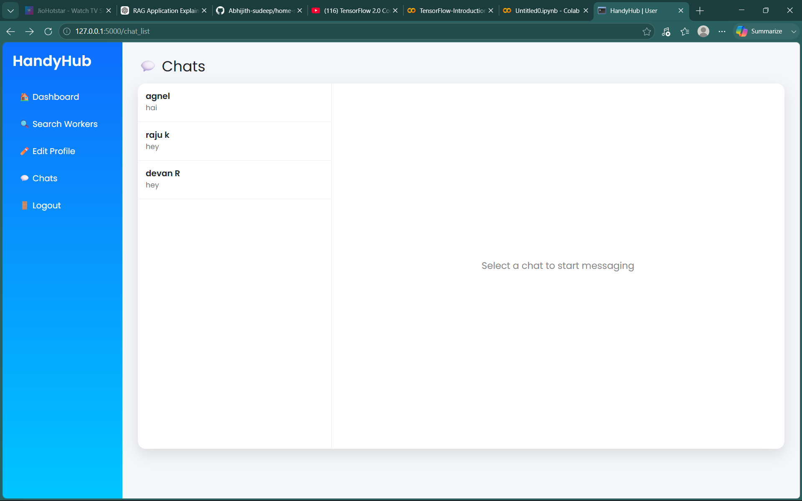

# Home Service Recommendation System

A Flask-based web application that connects users with service workers.

## Features

- User Registration/Login
- Worker Registration/Login
- Job Posting
- Worker Search
- Chat System
- Review System
- Machine Learning Recommendation

## Technologies Used

- Python
- Flask
- SQLAlchemy
- SQLite
- HTML/CSS
- Machine Learning

## Installation

git clone <repo-link>

pip install -r requirements.txt

python app.py
## Screenshots

### Home Page

### Login Page

### User Dashboard

### Worker Dashboard

### Search Services

### Chat System
